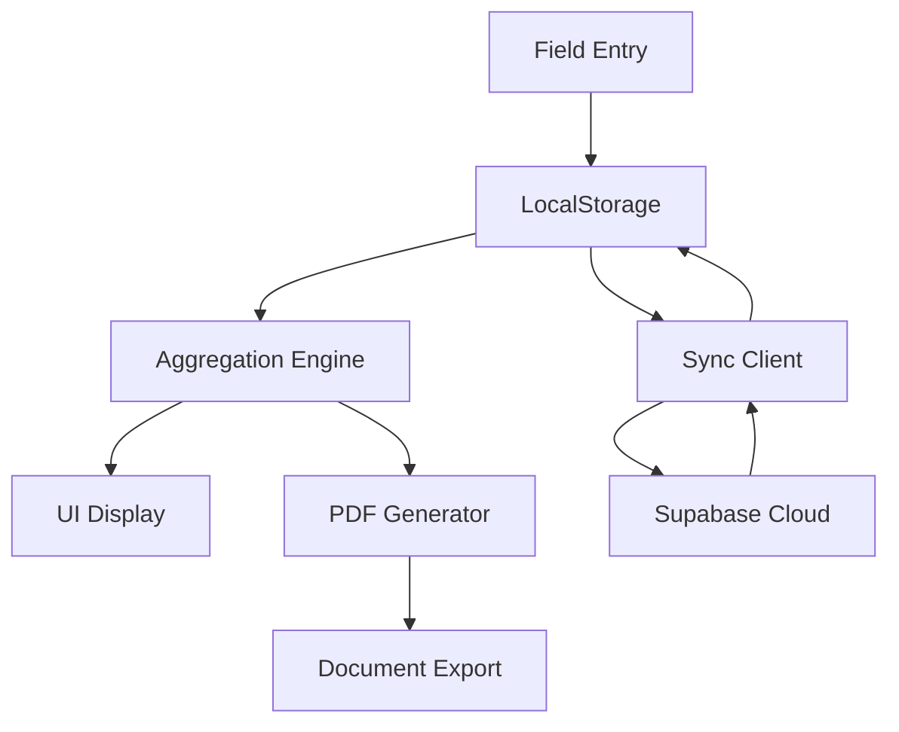
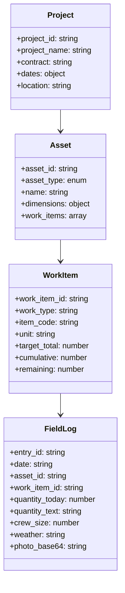

# Veritas MVP - Universal Infrastructure Management System

<div align="center">


**Production-Ready Construction Data Engine with Provenance Tracking**

[](LICENSE)
[](CHANGELOG.md)
[](#deployment-status)

[Features](#features) • [Quick Start](#quick-start) • [Documentation](#documentation) • [Architecture](#architecture)

</div>

---

## 🎯 Overview

Veritas MVP is a **universal infrastructure management system** and construction data engine that provides comprehensive project tracking, provenance documentation, and real-time progress monitoring. Built for construction supervisors, project managers, and stakeholders who need reliable, offline-capable tools for infrastructure project management.

### Key Capabilities

- **🏗️ Universal Asset Management** - Roads, buildings, flood control, bridges, utilities, and more
- **📱 Offline-First Progressive Web App** - Works anywhere, anytime
- **☁️ Cloud Sync with Supabase** - Bidirectional data synchronization
- **📊 Daily Summary Dashboard** - At-a-glance project insights (NEW - Task 19)
- **🔒 Cryptographic Provenance** - SHA-256 verified PDF documentation
- **📸 GPS-Enabled Photo Management** - Location-stamped field documentation
- **📋 Intelligent Work Item Matching** - Automated progress tracking
- **📄 PDF Generation** - Local and server-side report generation

---

## ✨ Features

### 🏗️ Asset & Work Item Management
- **8+ Asset Types**: Road sections, buildings, flood control, bridges, culverts, utilities, landscaping, and custom assets
- **Smart Templates**: Pre-configured work items for common infrastructure types
- **Progress Tracking**: Real-time cumulative and remaining calculations
- **Chainage Support**: Linear infrastructure with stationing (e.g., "0+000" to meters conversion)
- **Flexible Units**: Blocks, meters, linear meters, square meters, cubic meters, pieces, kg, tons, and custom units

### 📱 Progressive Web App
- **Mobile-First Design**: Touch-optimized interface for field use
- **Offline Operation**: Full functionality without network connectivity
- **Installable**: Works as a native app on mobile devices
- **Responsive Layout**: Adapts to phones, tablets, and desktops
- **Service Worker**: Intelligent caching for offline access

### 🔄 Data Synchronization
- **Bidirectional Sync**: LocalStorage ↔ Supabase with conflict resolution
- **Last-Writer-Wins**: Timestamp-based conflict resolution
- **Data Integrity**: Mission-critical fixes ensure complete data preservation
- **Offline Queue**: Changes sync automatically when connection restored
- **Export/Import**: JSON-based data portability with v2 format support

### 📊 Daily Summary Dashboard (NEW - Task 19)
- **Supervisory Overview**: 10-second comprehensive project snapshot
- **KPI Cards**: Active assets, work items, photos, and entries per day
- **Asset Accordions**: Collapsible per-asset progress breakdown
- **Activity Timeline**: Latest field entries with photo thumbnails
- **PDF Export**: On-demand daily summary generation with SHA-256 verification
- **Mobile-Optimized**: Responsive design for field supervisor workflows

### 📸 Photo Management
- **GPS Integration**: Automatic location capture with coordinate overlays
- **QR Code Generation**: Quick reference links to assets and entries
- **Gallery System**: Filtered viewing with thumbnails and modal display
- **Base64 Storage**: Offline-capable photo management
- **PDF Integration**: Photos embedded in provenance documents

### 🔒 Provenance & Documentation
- **Cryptographic Verification**: SHA-256 hash generation for all documents
- **Dual PDF Generation**: Local (client-side) and server-side options
- **Professional Layouts**: Compact, print-ready document formatting
- **Asset-Based Grouping**: Progress reports organized by asset → work item
- **Statement of Work**: Official progress documentation with crew and weather tracking

### 🧪 Testing & Quality Assurance
- **Playwright Test Suite**: Professional end-to-end browser automation
- **Mobile Testing**: Cross-device compatibility verification
- **Offline Testing**: Complete functionality validation without network
- **Performance Monitoring**: Load time and resource usage optimization
- **Regression Testing**: Automated workflow validation

---

## 🚀 Quick Start

### Prerequisites
- Modern web browser (Chrome, Firefox, Safari, Edge)
- Python 3.8+ (for simulation engine)
- Node.js 18+ (for testing suite)
- Supabase account (for cloud sync features)

### 1. Clone and Setup
```bash
git clone https://github.com/your-org/veritas-mvp.git
cd veritas-mvp
```

### 2. Start the Application

#### Option A: PWA Only (Recommended for most users)
```bash
# Open the Progressive Web App
open pwa/index.html
# or double-click pwa/index.html in File Explorer
```

#### Option B: Full Stack (Development)
```bash
# Start Python API Server
run_api.bat

# Open PWA in browser
open http://localhost:5000/pwa/index.html
```

### 3. Configure Cloud Sync (Optional)
```bash
# Edit configuration
cp pwa/config.js.example pwa/config.js
# Add your Supabase credentials to config.js
```

### 4. Run Tests (Development)
```bash
cd tests
npm install
npm test
```

### 5. Create Your First Project
1. Open the PWA in your browser
2. Click "Projects" → "New Project"
3. Select an asset template (Road, Building, or Flood Control)
4. Add work items and start tracking progress!

---

## 📁 Project Structure

```
veritas-mvp/
├── 📁 engine/                 # Python backend engine
│   ├── 📁 api/               # Flask API server
│   ├── 📁 generator/         # Construction progress simulation
│   ├── 📁 provenance/        # PDF generation with SHA-256
│   ├── 📁 schema/           # JSON schemas and examples
│   └── 📁 tests/            # Backend unit tests
├── 📁 pwa/                   # Progressive Web App
│   ├── 📄 app.js            # Main application logic (2000+ lines)
│   ├── 📄 auth.js           # Supabase authentication
│   ├── 📄 sync_client.js    # Bidirectional data sync
│   ├── 📄 pdf_local.js      # Client-side PDF generation
│   ├── 📄 sw.js             # Service worker for offline
│   ├── 📄 index.html        # Main application interface
│   ├── 📄 style.css         # Mobile-first responsive styling
│   └── 📄 config.js         # Supabase configuration
├── 📁 database/              # Database schema and migrations
│   ├── 📄 correct_migration.sql    # Production-ready migrations
│   ├── 📄 migrate_quantity_text.py # Migration automation
│   └── 📄 README.md              # Database documentation
├── 📁 tests/                 # Playwright end-to-end tests
│   ├── 📄 complete-end-to-end-test.spec.js
│   ├── 📄 field-entry-workflow.spec.js
│   ├── 📄 simple-working-test.spec.js
│   └── 📄 package.json
├── 📁 docs/                  # Project documentation
│   ├── 📁 operator_reports/  # Comprehensive system reports
│   ├── 📄 task19.md          # Daily Summary specification
│   └── 📄 logo.png           # Project branding
├── 📁 tools/                 # Utility scripts
│   ├── 📄 migrate_segments_to_assets.py
│   └── 📄 various helper scripts
├── 📄 CLAUDE.md              # AI assistant development guide
├── 📄 README.md              # This file
├── 📄 run_api.bat            # Windows API server launcher
└── 📄 LICENSE                # MIT License
```

---

## 🏗️ Architecture

### System Components

#### 1. **Python Engine** (`/engine`)
- **Flask API Server**: RESTful endpoints for simulation and provenance
- **Progress Generator**: Realistic construction progress simulation
- **PDF Provenance**: Cryptographic document generation with SHA-256
- **Schema Definitions**: JSON schemas for all data structures

#### 2. **Progressive Web App** (`/pwa`)
- **Application Core**: 2000+ lines of JavaScript for project management
- **Data Persistence**: LocalStorage-based offline data storage
- **Synchronization**: Bidirectional Supabase sync with conflict resolution
- **Mobile Interface**: Touch-optimized, responsive design
- **PDF Generation**: Client-side document creation with GPS integration

#### 3. **Data Layer**
- **LocalStorage**: Primary offline data storage
- **Supabase**: Cloud database with real-time sync
- **JSON Schemas**: Structured data validation and examples
- **Migration Tools**: Legacy data conversion utilities

### Data Flow



### Asset Management Model



---

## 📊 Daily Summary Dashboard (Task 19)

### Overview
The Daily Summary View provides supervisors with a comprehensive, at-a-glance overview of daily project activities. Designed for mobile field use, it delivers critical insights in 10 seconds or less.

### Key Features

#### 📈 KPI Dashboard
- **Active Assets**: Number of assets with daily activity
- **Work Items Touched**: Total work items with progress updates
- **Photos Captured**: Daily photo documentation count
- **Field Entries**: Total daily activity volume

#### 🏗️ Asset-Centric Organization
- **Collapsible Accordions**: Asset-wise activity organization
- **Progress Tracking**: Per-work-item cumulative and remaining quantities
- **Photo Integration**: Thumbnail galleries with modal viewing
- **Quick Actions**: Direct links to detailed views and PDF generation

#### 📱 Mobile-First Design
- **Responsive Layout**: Optimized for phones and tablets
- **Touch Interface**: 44px minimum touch targets
- **Offline Capability**: Full functionality without network
- **Performance Optimized**: Efficient data aggregation and rendering

#### 📄 PDF Export
- **On-Demand Generation**: Instant PDF creation for daily reports
- **SHA-256 Verification**: Cryptographic document integrity
- **Professional Layout**: Clean, print-ready formatting
- **Email Ready**: Optimized for stakeholder distribution

### Usage Workflow
1. **Select Project**: Choose from active projects
2. **Pick Date**: Defaults to today (Asia/Manila timezone)
3. **Review KPIs**: Quick overview of daily activity
4. **Expand Assets**: Detailed progress per asset/work item
5. **Export Reports**: Generate PDFs for distribution

---

## 🔧 Configuration

### Supabase Setup
1. Create a new Supabase project
2. Run the migration script: `database/correct_migration.sql`
3. Configure authentication providers
4. Update `pwa/config.js` with your credentials:

```javascript
const CONFIG = {
    SUPABASE_URL: 'your-supabase-url',
    SUPABASE_ANON_KEY: 'your-anon-key',
    ENABLE_SIMULATION_UI: false, // Production setting
    DEFAULT_TIMEZONE: 'Asia/Manila'
};
```

### Database Schema
The system uses PostgreSQL with the following key tables:
- `projects` - Project metadata and configuration
- `assets` - Universal infrastructure assets
- `field_logs` - Daily progress records with quantity preservation
- `work_items` - Measurable tasks within assets

### Asset Types
Supported infrastructure types:
- `road_section` - Linear road infrastructure
- `building` - Buildings and structures
- `flood_control` - Flood management systems
- `bridge` - Bridge infrastructure
- `culvert` - Culvert systems
- `utility` - Utility infrastructure
- `landscaping` - Landscaping projects
- `other` - Custom infrastructure types

---

## 🧪 Testing

### Automated Test Suite
```bash
cd tests
npm install
npx playwright install
npm test                    # Headless testing
npm run test:headed        # Browser visible testing
npm run test:debug         # Debug mode with inspector
```

### Test Coverage
- ✅ **Field Entry Workflow**: Complete data creation and validation
- ✅ **Asset Management**: Creation, editing, and deletion workflows
- ✅ **Sync Operations**: Offline/online data synchronization
- ✅ **PDF Generation**: Document creation and verification
- ✅ **Mobile Responsiveness**: Cross-device compatibility
- ✅ **Offline Functionality**: Complete operation without network
- ✅ **Error Handling**: Graceful failure and recovery

### Manual Testing Checklist
- [ ] Offline field entry creation
- [ ] Bidirectional sync with Supabase
- [ ] Asset template functionality
- [ ] Daily Summary dashboard rendering
- [ ] PDF generation and download
- [ ] Photo capture and GPS integration
- [ ] Cross-browser compatibility
- [ ] Mobile touch interactions

---

## 📚 Documentation

### Developer Documentation
- **[CLAUDE.md](CLAUDE.md)** - AI assistant development guide and system overview
- **[API Documentation](docs/api.md)** - REST API endpoint reference
- **[Schema Reference](docs/schemas.md)** - Data structure definitions and examples
- **[Migration Guide](docs/migrations.md)** - Database migration procedures

### Operator Documentation
- **[Daily Summary Guide](docs/operator_reports/Task_19_Daily_Summary_View_Implementation.md)** - Comprehensive feature documentation
- **[Data Integrity Report](docs/operator_reports/Task_19_Critical_Data_Integrity_Sync_Bug_Fixes.md)** - Critical fixes and resolutions
- **[User Manual](docs/user-manual.md)** - End-to-end user workflow guide
- **[Troubleshooting](docs/troubleshooting.md)** - Common issues and solutions

### Technical Documentation
- **[Architecture Overview](docs/architecture.md)** - System design and component interaction
- **[Database Schema](docs/database.md)** - Database structure and relationships
- **[Deployment Guide](docs/deployment.md)** - Production deployment procedures
- **[Performance Optimization](docs/performance.md)** - System tuning and optimization

---

## 🚀 Deployment

### Production Deployment

#### Option 1: Static Hosting (Recommended)
```bash
# Deploy PWA to any static hosting service
# - Netlify, Vercel, GitHub Pages, AWS S3, etc.
# No server requirements - fully client-side
```

#### Option 2: Full Stack Deployment
```bash
# Deploy Python API Server
# - Heroku, AWS Elastic Beanstalk, DigitalOcean, etc.
# Requires Python 3.8+ and Flask

# Deploy Supabase Database
# - Managed PostgreSQL with real-time sync
# - Authentication and row-level security
```

### Environment Configuration
```bash
# Production Environment Variables
export DATABASE_URL="your-postgres-connection-string"
export SUPABASE_URL="your-supabase-project-url"
export SUPABASE_KEY="your-supabase-anon-key"
export FLASK_ENV="production"
export DEBUG="false"
```

### Performance Optimization
- **Service Worker**: Intelligent caching for offline access
- **Image Compression**: Optimized photo storage and display
- **Lazy Loading**: On-demand asset and data loading
- **Bundle Optimization**: Minified CSS and JavaScript
- **CDN Integration**: Global content delivery network support

---

## 🤝 Contributing

We welcome contributions! Please see our [Contributing Guide](CONTRIBUTING.md) for details.

### Development Workflow
1. Fork the repository
2. Create a feature branch (`git checkout -b feature/amazing-feature`)
3. Commit your changes (`git commit -m 'Add amazing feature'`)
4. Push to the branch (`git push origin feature/amazing-feature`)
5. Open a Pull Request

### Code Standards
- **ESLint**: JavaScript code formatting and linting
- **Prettier**: Consistent code style
- **Playwright**: Test coverage requirements
- **Documentation**: README updates for new features

### Issue Reporting
Please use the [GitHub Issues](https://github.com/your-org/veritas-mvp/issues) for bug reports and feature requests.

---

## 📄 License

This project is licensed under the MIT License - see the [LICENSE](LICENSE) file for details.

### Copyright
```
Copyright (c) 2025 Veritas MVP

Permission is hereby granted, free of charge, to any person obtaining a copy
of this software and associated documentation files (the "Software"), to deal
in the Software without restriction, including without limitation the rights
to use, copy, modify, merge, publish, distribute, sublicense, and/or sell
copies of the Software, and to permit persons to whom the Software is
furnished to do so, subject to the following conditions:

The above copyright notice and this permission notice shall be included in all
copies or substantial portions of the Software.
```

---

## 📞 Support

### Getting Help
- **Documentation**: Check the [docs/](docs/) folder first
- **Issues**: Report bugs on [GitHub Issues](https://github.com/your-org/veritas-mvp/issues)
- **Discussions**: Feature requests and general discussion
- **Email**: support@veritas-mvp.com (for commercial support)

### Community
- **Discord**: Join our community Discord server
- **Twitter**: Follow @VeritasMVP for updates
- **Blog**: Read our development blog at blog.veritas-mvp.com

---

## 🗺️ Roadmap

### Version 2.1 (Q1 2026)
- [ ] Push notifications for daily summaries
- [ ] Advanced filtering and search
- [ ] Multi-language support
- [ ] Enhanced offline capabilities

### Version 2.2 (Q2 2026)
- [ ] Predictive analytics and forecasting
- [ ] Integration with project management tools
- [ ] Advanced reporting templates
- [ ] Mobile app store deployment

### Version 3.0 (Q3 2026)
- [ ] AI-powered progress recommendations
- [ ] Real-time collaboration features
- [ ] Enterprise SSO integration
- [ ] Advanced IoT sensor integration

---

## 📊 Deployment Status

<div align="center">

| Environment | Status | URL |
|-------------|--------|-----|
| **Production** | 🟢 Active | [app.veritas-mvp.com](https://app.veritas-mvp.com) |
| **Staging** | 🟡 Testing | [staging.veritas-mvp.com](https://staging.veritas-mvp.com) |
| **Development** | 🔧 Local | `localhost:5000` |

</div>

---

<div align="center">

**Built with ❤️ for construction professionals worldwide**

[Top of Page](#readme)

</div>